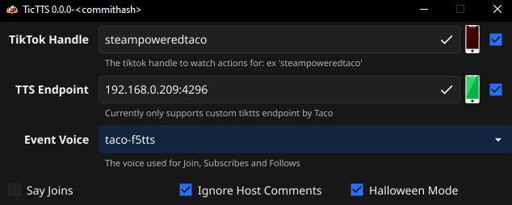

# tickTTS

A program that can listen to TikTok events and play them via various text to speech backends.

This is currently only designed to support a yet unreleased backend that scales out various locally ran TTS engines such as AllText and F5-TTS.

**Until another project is released OR support for third party services is added, this is only going to be useful for my wife :)**

## Why don't you support ElevenLabs/other public services?
The main issue is cost to test, create, and maintain those integrations.  I don't plan to release this basic functionality as a paid app.  If you want to sponsor work to make this open source including the local backends please contact me, and I'll consider it.

